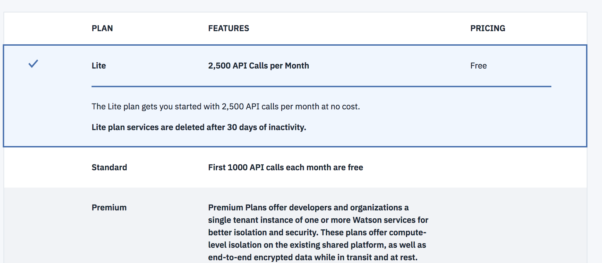

# Analyze earnings call transcripts with Watson Tone Analyzer and Natural Language Understanding

This lab uses the Tone Analyzer service to extract the most positive sentences  from earnings call transcripts and then runs those remarks through the Natural Language Understanding  service to extract the most relevant keywords and Semantic Roles  from those  sentences . 

After instances of Tone Analyzer and Natural Languaga Understanding, you'll test drive yhe scenario with a test application.

## 1. Setup

### 1.1 Sign up for IBM Cloud

If you are not already signed up for the IBM Cloud, [sign up here](https://console.bluemix.net)

### 1.2 Create an instance of the Watson Tone Analyzer Service

1.2.1 From the IBM Cloud Dashboard click on **Create resource**


1.2.2 Select the **Watson** category project type and then click on **Tone Analyzer**


1.2.3 Make sure the **Lite plan** is selected and then click **Create**


1.2.4 Select **Service credentials** at the left and then click on **View credentials** next to the credentials generated for your service instance


1.2.5 Click on the icon to copy the credentials to the clipboard and then save them in a text file on your Desktop (or some other convenient location). You'll need the **username** and **password** values later in the lab.


### 1.3 Create an instance of the Watson Natural Language Understanding Service

1.3.1 From the IBM Cloud Dashboard click on **Create resource**


1.3.2 Select the **Watson** category project type and then click on **Natural Language Understandingr**


1.3.3 Make sure the **Lite plan** is selected and then click **Create**


1.3.4 Select **Service credentials** at the left and then click on **View credentials** next to the credentials generated for your service instance


1.3.5 Click on the icon to copy the credentials to the clipboard and then save them in a text file on your Desktop (or some other convenient location). You'll need the **username** and **password** values later in the lab.


## 2 Test scenario

Test the scenario  using 3 earnings report transcripts  using  a standalone app. Both Python and Java are provided. Choose the one that you feel most comfortable with.  

Python app requirements

  - [Python 3.5](https://www.python.org/downloads) or later.

Java app requirements:

  - Java 1.7 or later JVM
  - [Gradle Build Tool](https://gradle.org) Note: Version 4.7 was used to verify this example


### 2.1 Test with a Python app

2.1.1 Edit the file ***settings.py*** in the ***tone-analyzer-nlu-python*** sub folder of this project. Put in the values of your Tone Analyzer **username** and **password** and your Natural Language Understanding  **username** and **password** that you saved earlier.

2.1.2 In a command prompt or terminal navigate to the ***tone-analyzer-nlu-python*** sub folder of this project. Run the following command to install the dependencies

`pip -r requirements.txt`

2.1.3 Run the following command to run the tester application

`python tone-analyzer-nlu.py`

2.1.4 Verify the app runs without errors and the output looks something like the following.

```
Analyzing  3 earnings call transcripts ...
Analyzing transcript file name ../test_data/JPMC1Q2018EarningsCall.txt

Most positive statements from earnings call:

1) Client investment assets were up 13% year-on-year with half of the growth from net new money flows and with record flows this quarter.

NLU Analysis:
keywords: Client investment assets, record flows, net new money
semantic_roles:
subject: Client investment assets action: were object: 13% year-on-year
...
```

### 2.2 Test with a Java app

2.2.1 Edit the file ***settings.properties*** in the ***tone-analyzer-nlu-java/src/main/resources*** sub folder of this project.Put in the values of your Tone Analyzer **username** and **password** and your Natural Language Understanding  **username** and **password** that you saved earlier.
 

2.2.2 In a command prompt or terminal navigate to the ***tone-analyzer-nlu-java*** sub folder of this project. Run the following command to build the app

**Linux/Mac**

`./gradlew build`

**Windows**

`gradle.bat build`

2.2.3 Run the following command to run the tester application

**Linux/Mac**

`./gradlew run`

**Windows**

`gradlew.bat run`

2.2.4 (Optional) Run the following command to generate Eclipse artifacts so the project can be imported into Eclipse 

**Linux/Mac**

`./gradlew eclipse`

**Windows**

`gradlew.bat eclipse`

Note: after running the command import this folder as an existing project into Eclipse


2.2.5 Verify the app runs without errors and the output looks something like the following.

```
Analyzing 3 earnings call transcripts

Analyzing transcript filename JPMC1Q2018EarningsCall.txt


Most positive statements from earnings call:

1) Client investment assets were up 13% year-on-year with half of the growth from net new money flows and with record flows this quarter.


NLU Analysis:
keywords: Client investment assets,record flows,net new money
semantic roles:
subject: Client investment assets action: were object: 13% year-on-year

...


```


## Conclusion
Congratulations ! You successfully worked with both Tone Analyzer and NLU to start creating a framework to extract highlights from earnings call transcripts.
